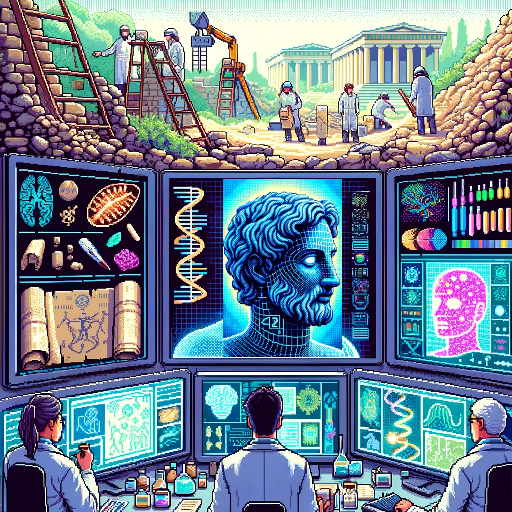

This repo contains an essay that describes how some future tech may be able to resurrect all humans who have ever lived.

It converts a seemingly religious topic into a technical and scientific problem. 

Surprisingly enough, this seems to be theoretically possible, given enough computational resources.

The essay is currently available in the following languages:

- [English](eng/text.md)
- [Russian](rus/text.md)

This entire repo, including the text and illustrations, is [released](LICENSE) into the public domain, allowing anyone to reprint, use, copy, modify it without any restrictions. 

Contributions are welcome! Please feel free to translate it into more languages, or contribute in any other way. 

