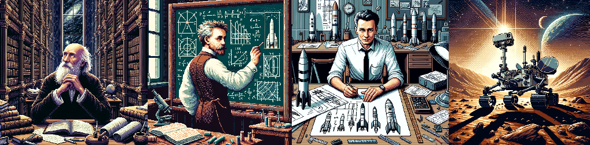
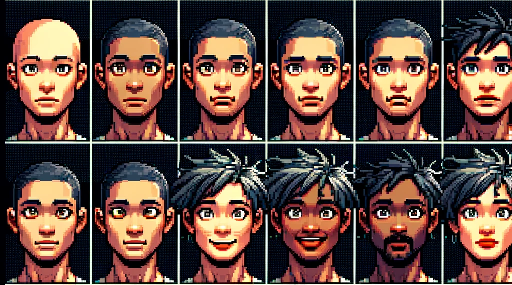
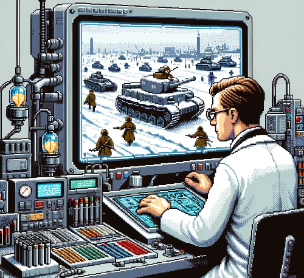
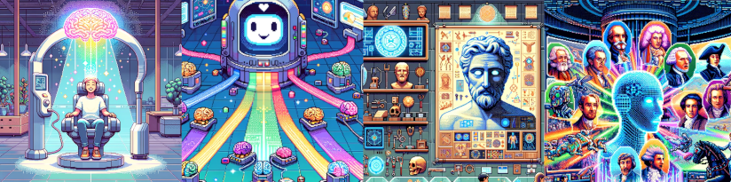
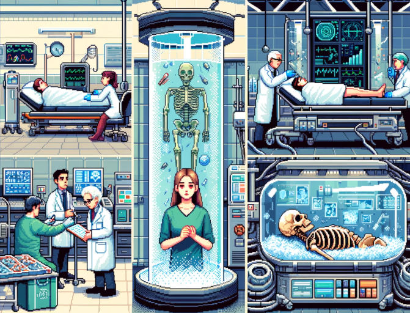
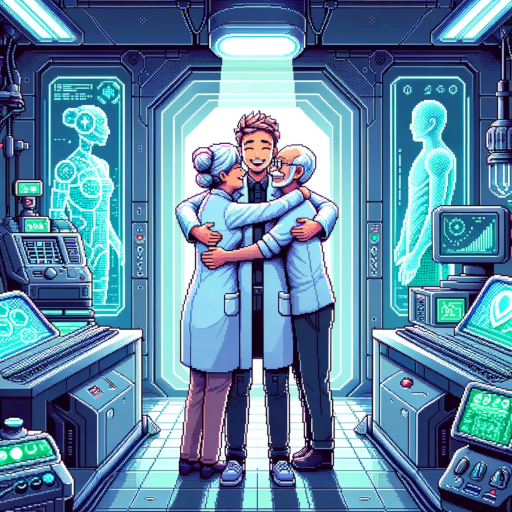

# Resurrecting all humans ever lived as a technical problem

One day, we might be able to bring back to life every human ever lived, by the means of science and technology. 
And it will be a good day.

## History

To the best of my knowledge, the idea was first described in detail by [Fyodorov](https://en.wikipedia.org/wiki/Nikolai_Fyodorovich_Fyodorov), a 19th century thinker.

Fyodorov argued that it is our moral duty to save our ancestors from the claws of death, to resurrect every human ever lived. And one day, we’ll have the technology.

If you think that the goal is a bit too ambitious for a 19th century thinker, here is another crazy goal of Fyodorov: to colonize space. 

His [pupil](https://ru.wikipedia.org/wiki/%D0%A4%D1%91%D0%B4%D0%BE%D1%80%D0%BE%D0%B2,_%D0%9D%D0%B8%D0%BA%D0%BE%D0%BB%D0%B0%D0%B9_%D0%A4%D1%91%D0%B4%D0%BE%D1%80%D0%BE%D0%B2%D0%B8%D1%87#cite_note-18)
 Tsiolkovsky framed it as a scientific problem.

Von Braun [read](https://en.wikipedia.org/wiki/Konstantin_Tsiolkovsky#Legacy) Tsiolkovsky, and converted the idea into a problem of applied engineering. 

And long story short, we now have robots on Mars.

As a side note, some of the biggest achievements of mankind were accomplished by the same procedure:

1. Set an outrageously ambitious goal
2. Convert it into a scientific problem
3. Ignore critics who call it unsolvable
4. Convert it into applied engineering
5. Solve it.

## Today

The Fyodorov’s idea of technological resurrection is not as popular as space exploration. It was mostly forgotten, and then rediscovered by modern transhumanists (for example, see the excellent works of [Alexey Turchin](https://philpapers.org/rec/TURYOL) on the topic).

These days, we routinely resurrect the dead (only a few decades ago, a patient without heartbeat would have been considered [legally dead](https://link.springer.com/chapter/10.1007/978-0-387-72966-4_4)). 
But the current resurrection tech only works immediately after death, and only under very specific conditions. 
Cryonics could help in many other cases, but it can’t work without a properly preserved brain.
An assumption

So, how do we resurrect Benjamin Franklin? Leonardo da Vinci? Archimedes?

There is no law of physics that makes it impossible to recreate the Archimedes’ brain. Even random motions of atoms [will recreate it](https://en.wikipedia.org/wiki/Boltzmann_brain), if you wait long enough.

Let’s assume that the idea of [“philosophical zombies”](https://en.wikipedia.org/wiki/Philosophical_zombie) is BS. A precise enough replica of the Archimedes’ brain will indeed generate the Archimedes’ mind, with all the existential bells & whistles. 

If the assumption is correct, then we can bring him back to life by reconstructing his brain, or by directly reconstructing his mind.

## Methods

Below I present some methods that could achieve that. Of course, all of them are highly speculative (yet).

### Method #1. Generate all possible human minds

The set of all possible human brains is finite (the [Bekenstein Bound](https://en.wikipedia.org/wiki/Bekenstein_bound) provides the absolute upper limit).

Thus, given enough computational resources, it's possible to generate a list of all possible human minds (in the same sense, as it's possible to generate a list of all 3-digit binary numbers).

The list of generated minds will include all possible human-sized minds: living, dead, unborn, and never-to-exist.

If two human minds are identical, then it's one and the same mind (in the same sense, as two identical binary numbers are the same number).

Thus, if we generate a binary number identical to an uploaded mind of Archimedes, then we successfully resurrected Archimedes.

Judging by our current (ridiculously incomplete) understanding of physics, generating all the minds will require a computer vastly larger than the universe. 
There are not enough resources in the universe to generate all possible books of 200 pages. And the average human mind is much larger than a book.

Another problem is what to do with the gazillions of minds we’ve generated (including trillions of slightly different versions of Archimedes). To run them all in real time, we might need to convert the entire galaxy into computronium.

Fortunately, we don’t have to enumerate all possible minds. We can apply some reasonable constrains  to greatly reduce the search space. For example, we are only interested in the minds compatible with the human brain.

The search space could be further reduced if we use the crumbs (the method #2).

The method could even become computationally tractable if we combine it with the method #4. 

### Method #2. Collect the crumbs

Every human is constantly scattering crumbs of information about them – from ideas to skin cells. Some humans are also leaving more long-lasting traces – from children to books to bones.

A Friendly AI of posthuman abilities might be able to collect all the crumbs of information still preserved, and create realistic reconstructions of the minds that scattered them.

For example, there is a finite set of brain-like neural networks that could write the works of Archimedes. 
The set of 3rd-century BC Greeks who could write the works of Archimedes is smaller. 
And if we find the Archimedes’ DNA, we could reduce the set further. 
At some point, we could find the only human mind that satisfies all the constrains, and it will be the mind of Archimedes.

### Method #3. Find a way to get arbitrary information from the distant past

It seems that the idea of time travel to the past contradicts the laws of physics (as we know them).
But there is no such a law that prevents us from copying some information from the past.

In fact, we constantly receive information from the past, e.g. by observing the light of the stars long gone.
Maybe there is a way to build a device that could show us the Battle of Stalingrad, or any other historical event, exactly as it has happened, with the same fidelity as a modern digital camera.

If such a device is possible, maybe uploading minds from the distant past is possible too.

### Method #4. Learn how to generate realistic human minds

This method is closely related to the method #2 ("collect the crumbs"). The idea is as follows:

1. Wait until billions of humans have uploaded their minds
2. Use the digital minds as a training data for an AI (with the minds' consent, of course)
3. Add all the historical data we have, from ancient manuscripts to DNA samples
4. The AI learns how to generate realistic human minds in their historical contexts, and then generates all the minds, for all historical epochs.

For example, we might ask the AI to generate all possible minds of 3rd-century BC Greeks who were able to invent the [Archimedean spiral](https://en.wikipedia.org/wiki/Archimedean_spiral). One of the generated minds could be close enough to Archimedes to consider it a success. 

Already, there are AIs that can generate surprisingly realistic human faces (see the image below). Given enough data, maybe we can do the same thing with minds.

### Method #5. Enumerate the parameters of the human mind

This method is closely related to the method #1 ("generate all possible human minds"). 

Imagine that you're a left-handed AI researcher who was home-schooled. You love clever Harry Potter fanfics. You're a native English speaker. You ate some pizza in February 2021. 

Thus, your mind has the following parameters: 

    mind_parameters = {
        "handedness": "left-handed",
        "job": "AI researcher",
        "homeschooled": True,
        "clever_harry_potter_fanfics_lover": True,
        "native_language": English,
        "ate_pizza_in_feb_2021": True,
        # <many other parameters>
    }

Some of the parameters have a huge impact on the person's behavior (for example, homeschooled). Other parameters usually have no lasting impact (like "ate_pizza_in_feb_2021").

As there is a finite number of possible human minds, there is a finite number of such parameters. And the number of impactful parameters could be quite small (perhaps in millions). 

By enumerating all realistic values of the impactful parameters, we could reconstruct all realistic human minds. 

This method generates approximate reconstructions. But they could suffice. For example, many people believe that they are mostly the same person as T years ago. If the difference between the approximate reconstruction and the original mind is smaller than the T-years-difference, then the reconstruction is good enough.

This method is much more tractable than the full binary enumeration of all possible minds. 

The computational requirements could be greatly reduced if we enumerate only historically accurate minds (e.g. there were no AI researchers in the 3th century BCE). The problem of combining incomplete historical data with enumeration of minds is similar to [learning Bayesian networks with missing data](https://web.archive.org/web/20180706014020/https://cs.brown.edu/research/ai/dynamics/tutorial/Documents/GibbsSampling.html), a well developed field that already has some pretty efficient algorithms. 

One could argue that the human mind is nothing like a video game character who has only a limited number of traits. But even in our current minuscule population of 7 billion, there are so many like-minded people making the same life decisions, we must conclude that the number of possible traits is indeed limited.   

# Some ethical considerations

How would you answer the following questions?

1) Imagine that a girl is in an intensive care unit. Her heart stops. If the right tech is applied, we can bring her back. Is it an ethical goal to revive her?

2) Imagine that a girl is a cryonics patient, frozen in liquid nitrogen. By any definition of the today’s medicine, she is dead. But if the right tech is applied, we can bring her back. Is it an ethical goal to revive her?

3) Imagine that a girl died in 1930. Except for a few bones, there is nothing left of her.  But if the right tech is applied, we can bring her back. Is it an ethical goal to revive her?

I answer “yes” to all 3 questions, as I don’t see any ethical difference between them.

The value of saving a human life should not expire with time. It should not depend on when is the human in danger. Resurrecting is ethically equal to saving a human in grave danger.

But how to handle the people who don’t want to live anymore? Resurrecting them doesn’t make sense unless we also repair their will to live (the repair should be done under their consent, of course).
In many cases, some combination of these measures will suffice:

- bringing back their beloved ones (we are resurrecting everyone anyway)
- fixing the underlying organic problems (e.g. their [gut microbiome](https://www.ncbi.nlm.nih.gov/pmc/articles/PMC7510518/) causing suicidal thoughts).
- conducting a comprehensive psychiatric intervention.

But in some cases, none of this will help. How to handle such cases?

Also, how to handle mass murderers? If we resurrect everyone, then we also resurrect Hitler, and all the other bad people from the past (and maybe from the future). Converting them into decent people will be another huge problem (the conversion should be done under their consent, of course).

In general, I think the strongest argument against the resurrection idea is that there might be more ethical ways to spend the necessary (enormous) resources, even in a post-scarcity society.
Some projects could save more lives than the estimated 100+ billion humans awaiting resurrection. For example, if the heat death of the Universe is real and preventable, a post-scarcity society might decide to invest most of its resources into a solution. 
But after the more pressing issues are resolved, we can (and should) start the resurrection project.

# Some practical consequences

So, there might be a chance of bringing all humans ever lived back to life.

This includes Archimedes. And your grandma. And even you (especially, if you’re still procrastinating about cryonics).  

Unfortunately, even after learning about this idea, you still need to exercise, and eat healthy, and avoid risking your life for dumb fun.
The entire resurrection idea is speculative. It might not work. It might be forgotten in a few centuries. Or we might become extinct in a few decades. The idea could give you hope, but it doesn’t make you immortal.

On the other hand, it’s a benevolent dawkinsonian meme:
if you promote the idea of technological resurrection, you increase the chance of bringing your beloved ones back to life by the means of science and technology.

Maybe resurrection is indeed a solvable technical problem. And maybe saving 100+ billion humans is a worthy cause.

