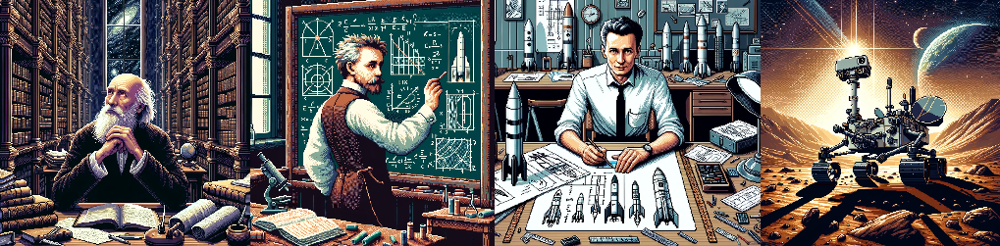
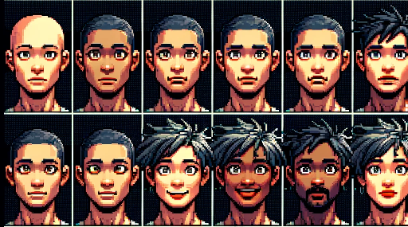
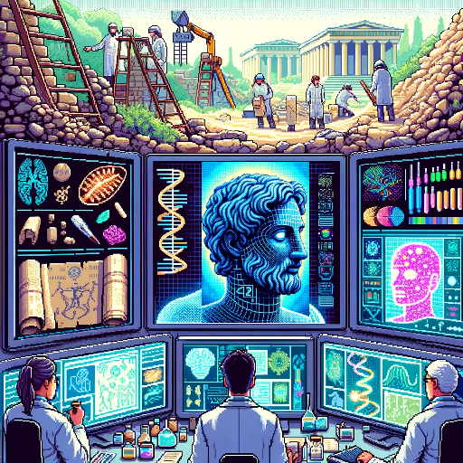
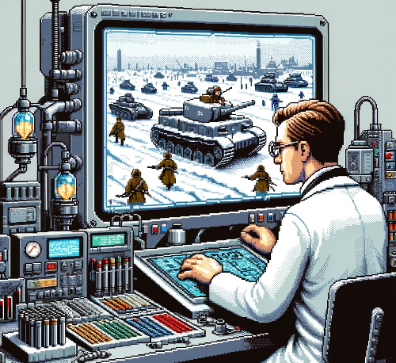
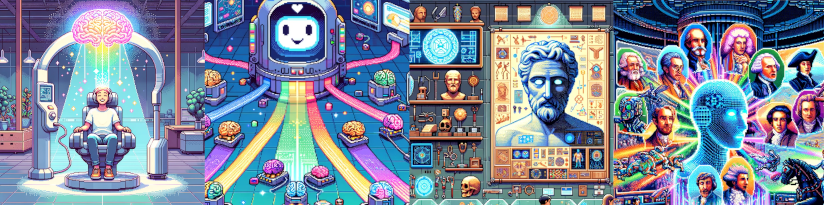
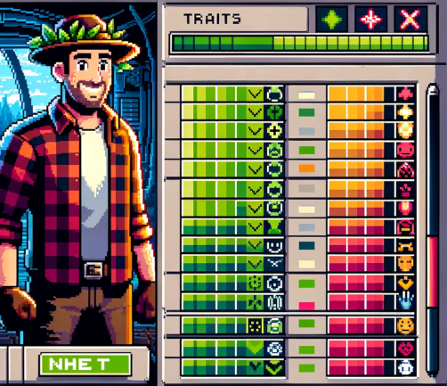
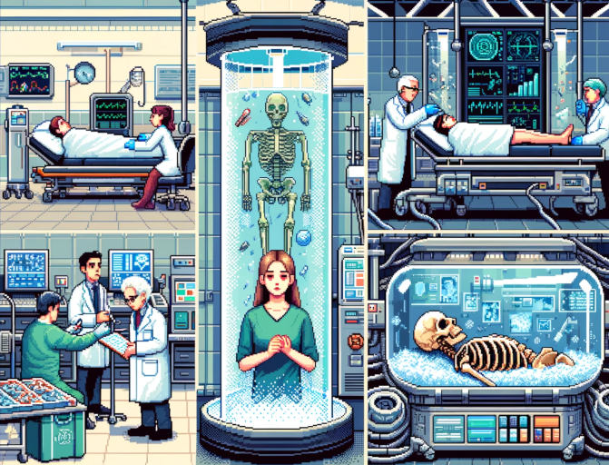
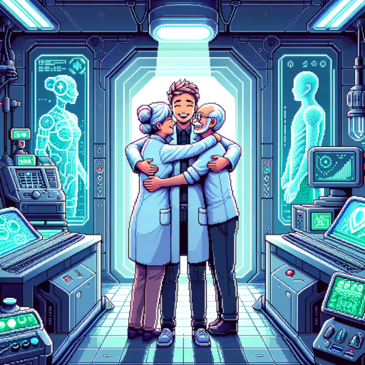

# Научно-техническая проблема всеобщего воскрешения умерших

## История

Насколько известно авторам этой статьи, впервые идея всеобщего технологического воскрешения была описана русским философом XIX века Николаем Федоровым.

Федоров утверждал, что наш моральный долг - спасти наших давно умерших предков из плена смерти, воскресить всех когда-либо живших людей. И однажды уровень научно-технического развития человечества станет достаточным для этого.

Если вам кажется, что эта мечта слишком амбициозна для мыслителя XIX века, то можно вспомнить еще одну безумную мечту Федорова: колонизация космоса. 
Его ученик Циолковский преобразовал мечту Федорова в научную проблему.
Фон Браун и Королёв преобразовали научную проблему Циолковского в прикладную инженерную задачу. 
И теперь у нас есть надежные космические ракеты, люди на орбите, и даже роботы-исследователи на Марсе.

Попутно заметим что многие научно-технические достижения человечества были достигнуты таким же образом: 

1. Возникает безумная мечта
2. Безумная мечта превращается в научную проблему
3. Научная проблема превращается в прикладную инеженерную задачу
4. Задача решается.

 
## Сегодня

Мечта Федорова о технологическом воскрешении не пользуется такой популярностью, как его мечта об освоении космоса. Она была в основном забыта, а затем заново открыта современными трансгуманистами (например, см. прекрасные работы Алексея Турчина на эту тему).

В наши дни мы регулярно воскрешаем мертвых (всего несколько десятилетий назад пациент без сердцебиения считался бы юридически мертвым). 
Но нынешние "технологии воскрешения" работают только при очень специфических условиях, и только когда пациент не совсем мертв (по нынешним критериям смерти).
Также есть крионика, но она может сработать только если мозг сохранен должным образом.

## Допущение

Итак, как нам воскресить Ломоносова? Леонардо да Винчи? Архимеда?

Нет такого закона физики, который запрещал бы воссоздание мозга Архимеда. Даже случайные движения атомов способны воссоздать его, если подождать достаточное количество триллионов лет.

Примем, что идея "философских зомби" не имеет под собой оснований. Достаточно точная копия архимедова мозга действительно породит психику именно Архимеда, а не какую-то бездушную реплику.

Если это предположение верно, то существует гипотетическая возможность вернуть Архимеда к жизни: либо путем реконструкции его мозга, либо путем реконструкции его психики другими способами.

## Методы

Ниже мы опишем некоторые методы, которые могут быть использованы для достижения этой цели. Разумеется, все они носят весьма спекулятивный характер (на момент написания этой статьи).

### Метод № 1. Сгенерировать все возможные варианты человеческой психики

Множество всех возможных конфигураций атомов в человеческом мозге - НЕ бесконечное (абсолютный верхний предел дает Лимит Бекенштейна).

То есть при достаточных вычислительных ресурсах теоретически возможно создать список всех возможных вариантов человеческого мозга (в том же смысле, как мы можем создать список всех трехзначных двоичных чисел).

Список будет включать все возможные варианты человеческой психики: всех ныне живущих, всех умерших, нерожденных и никогда не существовавших людей.

Если два варианта психики идентичны, то это одна и та же психика (в том же смысле, в каком два одинаковых двоичных числа являются одним и тем же числом).

Если мы каким-то образом получим бинарные данные, соответствующие цифровой реплике конкретного человека, то мы по сути получим психику этого человека. И если этот человек - Архимед, то мы успешно воскресили Архимеда.

Судя по нашему нынешнему (весьма неполному) пониманию физики, для генерации всех вариантов психики потребуется компьютер, значительно превышающий размеры Вселенной. 
Во Вселенной не хватит ресурсов, чтобы сгенерировать все возможные книги на 200 страниц. А психика среднего человека по объему данных гораздо больше такой книги (к примеру, некоторые люди могут дословно воспроизвести книгу на сотни страниц).

Еще одна проблема заключается в том, что именно делать с гигантским количеством сгенерированных вариантов психики (включая триллионы слегка отличающихся друг от друга версий Архимеда). Если дать всем им возможность жить в цифровой симуляции в реальном времени, то для этого видимо придется сконвертировать материю целой галактики в комьютрониум.

К счастью, нам не нужно генерировать все возможные варианты психики. Мы можем наложить некоторые разумные ограничения, чтобы значительно сократить диапазон поиска. Например, нас интересуют только варианты психики, совместимые с человеческим мозгом (нет смысла учитывать варианты психики существ с шестью глазами и тп).

Дипазон поиска можно еще больше сократить, если использовать "метод крошек" (метод №2, см. ниже).

Возможно мы даже сумеем перевести эту проблему из области фантастики в область прикладного инжиниринга, если в добавок будем использовать метод №4 (см. ниже).

### Метод № 2. Собрать информацию по крупицам

Каждый человек постоянно рассеивает информацию о себе - от высказанных идей до отпавших клеток кожи. Некоторые люди оставляют после себя и более долговременные следы - дети, книги, свои кости.

Дружественный ИИ с постчеловеческими способностями мог бы собрать все сохранившиеся крохи информации и создать реалистичную реконструкцию соответствующей психики.

К примеру, существует *конечное* множество нейронных сетей, способных повторить изобретения и открытия Архимеда. 
Количество греков III века до н.э. - еще меньше. 
И если мы найдем ДНК Архимеда, то сможем еще сильнее сократить это область поиска. 
Когда-нибудь мы сможем вычислить ту единственную человеческую психику, которая соответствует всей известной информации об Архимеде, и это будет психика Архимеда.

### Метод №3. Найти способ получения произвольной информации из далекого прошлого

По всей видимости, путешествия во времени в прошлое противоречят законам физики (насколько мы их понимаем на сегодняшний день).
Однако не существует такого закона физики, который запрещал бы копировать информацию из прошлого.

Более того, мы постоянно получаем информацию из прошлого, например, наблюдая свет давно угасших звезд.
Возможно в будущем мы сможем создать устройство, которое  покажет нам Сталинградскую битву или любое другое историческое событие в точности так, как оно произошло, с качеством картинки как у современного цифрового фотоаппарата.

Если такое устройство возможно, то, наверное можно наблюдать не только битвы давно минувших дней, но и нейробиологические процессы в мозгу отдельных людей. А если мы сможем получить из прошлого детальную информацию о мозге давно умершего человека, мы можем попытаться воссоздать его.  

### Метод №4. Научиться генерировать реалистичные варианты психики

Этот метод тесно связан с методом № 2 ("Собрать информацию по крупицам"). Идея заключается в следующем:

1. Ждем когда появится общедоступная технология загрузки сознания (mind uploading), 
2. Миллиарды людей "загружают" себя.
3. Тренируем ИИ на  полученных цифровых разумах (разумеется, с их согласия)
4. Даём этому же ИИ все имеющиеся у нас исторические данные - от древних манускриптов до образцов ДНК.
5. Модифицируем этот ИИ таким образом, чтоб он мог генерировать реалистичную человеческую психику в историческом контексте.
6. С помощью ИИ генерируем психику каждого человека из каждой исторической эпохи.

Например, мы можем попросить ИИ сгенерировать всех возможных греков III в. до н.э., способных изобрести архимедову спираль. Психика одного из них может оказаться достаточно сходной с психикой Архимеда чтобы считать процесс успешным. 

Уже существуют ИИ, способные генерировать удивительно реалистичные человеческие лица (см. иллюстрацию ниже). При наличии достаточного количества данных, возможно, мы сможем сделать то же самое не только с лицом, но и c психикой человека.

### Метод №5. Воспроизвести параметры психики

Этот метод тесно связан с методом № 1 ("Сгенерировать все возможные варианты человеческой психики"). 

Представьте, что вы - выпускник МГУ, левша, и физик по образованию. Вы любите умные фанфики по Гарри Поттеру. Ваш родной язык - русский. 31-го декабря 2019 года вы кушали пельмени. 

Соответственно, ваша психика имеет следующие параметры: 

    параметры = {
        "преобладающая рука": "левая",
        "высшее образование": "физик",
        "университет": "МГУ",
        "любитель умных фанфиков по Гарри Поттеру?": "Да",
        "родной язык": русский,
        "кушал пельмени 31-го декабря 2019 года": "Да",
        # <множество других параметров>
    }

Некоторые из параметров оказывают огромное влияние на поведение человека (например, в каком университете он учился). Другие параметры обычно не оказывают длительного влияния (например, "кушал пельмени 31-го декабря 2019 года").

Поскольку существует конечное число возможных вариантов человеческой психики, существует и конечное число таких параметров. При этом число влияющих параметров может быть относительно небольшим (к примеру, несколько миллионов). 

Перебрав все реалистичные значения параметров, мы могли бы реконструировать все реалистичные варианты психики. 

Этот метод генерирует приблизительные реконструкции. Но и их может быть достаточно. К примеру, читатель скорей всего согласится с тем, что он - тот же самый человек, что и T лет назад, где Т может быть исчислятся годами или даже десятилетиями. Если разница между приблизительной реконструкцией и вами - меньше чем разница в T лет, то реконструкция - удалась.

Этот метод намного проще реализовать чем полный двоичный перебор всех возможных вариантов психики (метод #1).

Минимальные требования к железу для таких вычислений могут быть значительно снижены если мы будем перебирать только исторически достоверные варианты (например, в III веке до н. э. не было выпускников МГУ). В техническом плане, это похоже на обучение байесовских сетей с недостающими данными (learning Bayesian networks with missing data) - развитую область, в которой уже есть довольно эффективные алгоритмы. 

Можно возразить, что формирование человеческой психики совсем не похоже на создание персонажа в РПГ, у которого лишь небольшое числе параметров.  Но даже в нашей нынешней мизерной популяции в 7 миллиардов человек легко можно найти так много одинаково мыслящих людей, принимающих одинаковые жизненные решения, что мы должны сделать вывод, что количество возможных параметров психики действительно весьма ограничено.

# Некоторые этические соображения

1) Представьте, что девушка находится в отделении интенсивной терапии. Ее сердце останавливается. Если применить подходящие технологии, мы сможем вернуть ее к жизни. Этично ли оживить ее?

2) Представьте, что девушка является крионическим пациентом, замороженным в жидком азоте. Согласно формальным критериям нынешней медицинской науки, она мертва. Но если применить подходящие технологии, мы сможем ее вернуть к жизни. Этично ли оживить ее?

3) Представьте, что девушка умерла в 1930 году. Кроме костей в могиле, от нее ничего не осталось.  Но если применить подходящие технологии, мы сможем ее вернуть к жизни. Этично ли оживить ее?

Автор этой статьи отвечает "да" на все три вопроса, поскольку не видит между ними никакой этической разницы.

Ценность спасения человеческой жизни не должна теряться со временем. Она не должна зависеть от того, *когда* человек находится в опасности. Воскрешение давно умершего человека с этической точки зрения равноценно спасению нынеживущего человека, находящегося в смертельной опасности.

А как быть с умершими людьми - самоубийцами? Нет смысла их воскрешать если мы заодно не вернем им волю к жизни.
Во многих случаях для этого будет достаточно следующих мер:

  -  вернуть их любимых (раз мы и так воскрешаем всех, значит воскресим и их)
  - устранение телесных проблем, которые могут усиливать склонность к суициду (к примеру, наркотическая зависимость, психиатрические расстройства вызванные нарушениями в микробиоме кишечника, и др.)
  - проведение психиатрического лечения.

Но в некоторых особо тяжелых случаях ничто из этого не поможет. Как быть?

Связанный вопрос: как поступать с массовыми убийцами? Если мы воскресим всех, то мы также воскресим Гитлера и всех других плохих людей из прошлого. Нужно будет найти способ конвертации таких людей в добропорядочных граждан.

В целом, по мнению авторов этой статьи, самый сильный аргумент против идеи всеобщего технологического воскрешения - следующий:
такой проект потребует поистинне огромнных ресурсов, и возможно эти ресурсы стоит потратить на более социально полезные проекты. Эта дилемма может сохраниться даже в гораздо более развитой цивилизации чем человечество 21го века.

Некоторые проекты могут спасти больше жизней, чем предполагаемые 100+ миллиардов людей, ожидающих воскрешения. Например, если тепловая смерть Вселенной реальна и ее можно предотвратить, то человечеству могут потребоваться те же огромные ресрусы для ее предотвращения. 
Но после решения более насущных проблем мы можем (и должны) приступить к проекту всеобщего технологического воскрешения.

# Некоторые практические соображения

Итак, возможно, есть шанс вернуть к жизни всех когда-либо живших людей.

В том числе и Архимеда. И вашу бабушку. И даже лично вас, если вы не доживёте до технологий радикального продления жизни.

К сожалению, даже с учетом такой гипотетической возможности, вам все равно нужно заниматься спортом, правильно питаться и не рисковать жизнью попусту.
Вся эта идея технологического воскрешения является спекулятивной. Она может не сработать. О ней могут забыть через несколько веков. Или мы вымрем через несколько десятилетий, и никто не сможет воплотить ее в жизнь. Эта идея может дать вам надежду, но она не делает вас бессмертным.

С другой стороны, эта идея - полезный докинсоновский мем:
если вы продвигаете идею технологического воскрешения, вы увеличиваете шанс вернуть к жизни своих любимых с помощью науки и техники.

Может быть, воскрешение - это действительно решаемая техническая проблема. И, возможно, спасение 100+ миллиардов человеческих жизней - благородная цель. 

